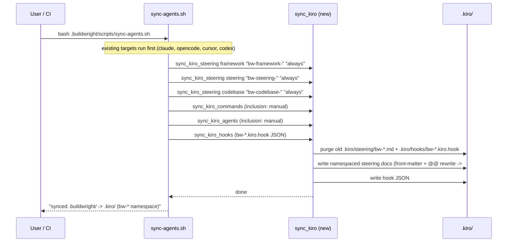

# Design Document: kiro-host-support

## Overview

Add Kiro as a first-class buildwright host by teaching `.buildwright/scripts/sync-agents.sh` to
generate Kiro-native artifacts under `.kiro/` (steering docs, agent-hook JSON) from the same
canonical `.buildwright/` source the other targets read, and by adding a Kiro column to the
`capability.md` table. All generated Kiro output is namespaced with a `bw-` prefix and gitignored so
it never clobbers the team's existing committed `.kiro/steering/*.md`, and existing
Claude/Cursor/OpenCode/Codex targets are left byte-for-byte unchanged.

## Mapping: buildwright canonical -> Kiro native primitives

Kiro has no Claude-style slash commands. The mapping leans on Kiro steering docs (with
`inclusion` front-matter) as the universal carrier, plus agent hooks for lifecycle wiring.

| buildwright canonical | Kiro native primitive | `inclusion` mode | Invocation |
|---|---|---|---|
| `framework/*.md` (fixed behaviour) | `.kiro/steering/bw-framework-*.md` | `always` | Auto-loaded every session |
| `steering/*.md` (philosophy, tech, product) | `.kiro/steering/bw-steering-*.md` | `always` | Auto-loaded every session |
| `codebase/*.md` (generated analysis) | `.kiro/steering/bw-codebase-*.md` | `always` (fallback `manual` if large) | Auto-loaded every session |
| `commands/bw-*.md` (bw-work, bw-plan, ...) | `.kiro/steering/bw-command-<name>.md` | `manual` | User types `#bw-command-bw-work` in chat |
| `agents/*.md` (personas) | `.kiro/steering/bw-agent-<name>.md` | `manual` | Referenced by command docs / typed `#bw-agent-staff-engineer` |
| command auto-run on save/prompt (optional) | `.kiro/hooks/bw-<name>.kiro.hook` | n/a | Trigger fires (UserPromptSubmit / PostFileSave) |

Rationale for the `bw-*` namespace: the existing Claude/Codex targets already only touch `bw-*`
subdirs and never a project's own skills. `.kiro/steering/` is a *shared, committed* directory
holding the team's own docs (clickup-context, formance-reference, etc.), so the Kiro target applies
the same discipline — it owns only `.kiro/steering/bw-*.md` and `.kiro/hooks/bw-*.kiro.hook`, and
`--delete` semantics are scoped to that glob only.

## Main Workflow



## Generated Kiro File Layout

```
.kiro/
  steering/
    bw-framework-autonomy.md          # inclusion: always
    bw-framework-capability.md        # inclusion: always
    bw-framework-findings.md          # inclusion: always
    bw-framework-tasks-to-issues.md   # inclusion: always
    bw-steering-philosophy.md         # inclusion: always
    bw-steering-tech.md               # inclusion: always   (only if source exists)
    bw-steering-product.md            # inclusion: always   (only if source exists)
    bw-codebase-STACK.md              # inclusion: always   (only if .buildwright/codebase/ exists)
    bw-codebase-ARCHITECTURE.md
    bw-codebase-CONVENTIONS.md
    bw-codebase-CONCERNS.md
    bw-command-bw-work.md             # inclusion: manual
    bw-command-bw-plan.md             # inclusion: manual
    bw-command-bw-verify.md           # inclusion: manual
    bw-command-bw-ship.md             # inclusion: manual
    bw-command-bw-analyse.md          # inclusion: manual
    bw-agent-staff-engineer.md        # inclusion: manual
    bw-agent-security-engineer.md     # inclusion: manual
    clickup-context.md                # UNTOUCHED committed project docs
    formance-reference.md             # UNTOUCHED
    ... (other project-owned steering) # UNTOUCHED
  hooks/
    bw-verify-on-save.kiro.hook       # optional; only emitted if a hook manifest exists
```

Naming avoids collisions: no project doc uses a `bw-` prefix today, and the sync only ever
creates/deletes files matching `bw-*` in these two directories.

## Core Interfaces / Types

```bash
# --- Kiro sync contract (all functions honour the existing global CHECK_ONLY + SYNC_NEEDED) ---

# sync_kiro_steering SRC_DIR NAME_PREFIX INCLUSION
#   SRC_DIR    : .buildwright/{framework,steering,codebase}
#   NAME_PREFIX: bw-framework- | bw-steering- | bw-codebase-
#   INCLUSION  : always | manual   (value for steering front-matter)

# sync_kiro_command_dir SRC_DIR NAME_PREFIX
#   Converts commands/agents into inclusion:manual steering docs.
#   SRC_DIR    : .buildwright/{commands,agents}
#   NAME_PREFIX: bw-command- | bw-agent-

# sync_kiro_hooks
#   Emits .kiro/hooks/bw-*.kiro.hook JSON from an optional manifest; no-op if none.

# kiro_frontmatter INCLUSION DESCRIPTION  -> stdout   (emits the YAML front-matter block)
# purge_bw_namespace GLOB                 -> deletes generated files (write mode only)
```

Kiro steering front-matter shape (the "type" being produced):

```yaml
---
inclusion: always | manual | fileMatch
fileMatchPattern: "<glob>"   # present only when inclusion == fileMatch
description: "<one line>"     # optional; sourced like Cursor's description
---
```

Kiro hook JSON shape (`.kiro/hooks/*.kiro.hook`):

```json
{
  "enabled": false,
  "name": "string",
  "description": "string",
  "version": "1",
  "when": { "type": "UserPromptSubmit | PostFileSave | PreToolUse", "patterns": ["glob"] },
  "then": { "type": "askAgent | command", "prompt": "string", "command": "string" }
}
```

## Path-Rewrite Logic

The Kiro target follows the same rule the other targets use: rewrite the read-marker
`@@.buildwright/` to the host-specific location; leave bare `.buildwright/` (canonical/write paths)
untouched. Kiro references another steering/context file with `#[[file:<path>]]`, so the rewrite
maps `@@.buildwright/<rest>` to a Kiro file reference into the generated namespace.

```
@@.buildwright/framework/autonomy.md   ->  #[[file:.kiro/steering/bw-framework-autonomy.md]]
@@.buildwright/framework/capability.md ->  #[[file:.kiro/steering/bw-framework-capability.md]]
@@.buildwright/agents/staff-engineer.md->  #[[file:.kiro/steering/bw-agent-staff-engineer.md]]
@@.buildwright/steering/philosophy.md  ->  #[[file:.kiro/steering/bw-steering-philosophy.md]]
bare .buildwright/... (no @@)          ->  unchanged
```

Because the source uses subdir paths (`framework/x.md`) but Kiro flattens to prefixed filenames
(`bw-framework-x.md`), the rewrite is not a single fixed prefix swap like the other targets; it maps
each canonical subdir to its Kiro prefix. This is the one Kiro-specific wrinkle.

### Function: kiro_ref_rewrite()

```bash
kiro_ref_rewrite(file)
```

**Preconditions:**
- `file` exists and is a readable `.md` file already copied into `.kiro/steering/`.
- The canonical subdir -> prefix mapping is fixed: `framework/`->`bw-framework-`,
  `steering/`->`bw-steering-`, `codebase/`->`bw-codebase-`, `agents/`->`bw-agent-`,
  `commands/`->`bw-command-`.

**Postconditions:**
- Every `@@.buildwright/<subdir>/<name>.md` in `file` becomes
  `#[[file:.kiro/steering/<prefix><name>.md]]`.
- Every bare `.buildwright/...` reference is preserved verbatim.
- No other bytes of `file` are modified.

**Loop invariant:** after processing mapping entry _k_, all references whose subdir is among
mappings `1..k` are rewritten; references for unprocessed subdirs are still in `@@` form.

## Algorithmic Pseudocode

### Top-level integration point (added at end of sync-agents.sh, after Codex block)

```bash
# ============================================================================
# 5. .buildwright/ -> .kiro/ (Kiro steering docs + agent hooks)
#    Generated output is namespaced bw-* and gitignored; existing committed
#    .kiro/steering/*.md project docs are never touched.
# ============================================================================
sync_kiro_steering ".buildwright/framework" "bw-framework-" "always"
sync_kiro_steering ".buildwright/steering"  "bw-steering-"  "always"
sync_kiro_steering ".buildwright/codebase"  "bw-codebase-"  "always"
sync_kiro_command_dir ".buildwright/commands" "bw-command-"
sync_kiro_command_dir ".buildwright/agents"   "bw-agent-"
sync_kiro_hooks
```

### kiro_frontmatter()

```bash
ALGORITHM kiro_frontmatter(inclusion, description)
BEGIN
  PRINT "---"
  PRINT "inclusion: " + inclusion
  PRINT "description: \"" + description + "\""
  PRINT "---"
END
```

**Preconditions:** `inclusion` is one of `always | manual | fileMatch`.
**Postconditions:** emits a valid Kiro steering front-matter block to stdout; no side effects.

### sync_kiro_steering()

```bash
ALGORITHM sync_kiro_steering(src, prefix, inclusion)
INPUT : src directory, filename prefix, inclusion mode
OUTPUT: .kiro/steering/<prefix>*.md written (or verified under CHECK_ONLY)
BEGIN
  IF NOT is_directory(src) THEN RETURN           // codebase/steering may be absent

  IF CHECK_ONLY = false THEN
    // scoped purge: only THIS prefix, never project docs
    purge_bw_namespace ".kiro/steering/" + prefix + "*.md"
    make_dir ".kiro/steering"
  END IF

  FOR EACH src_file IN sorted(find src -name "*.md") DO
    base      <- basename(src_file without ".md")
    IF base IN {README, TEMPLATE} THEN CONTINUE   // meta files are not steering
    dst_file  <- ".kiro/steering/" + prefix + base + ".md"
    desc      <- derive_description(src_file)      // reuse Cursor's awk: frontmatter desc, else first heading

    INVARIANT: all files emitted so far are valid steering docs with front-matter

    body      <- strip_frontmatter(src_file)       // reuse existing helper

    IF CHECK_ONLY = true THEN
      tmp <- mktemp
      { kiro_frontmatter(inclusion, desc); body } > tmp
      apply kiro_ref_rewrite ON tmp
      IF NOT exists(dst_file) OR differs(dst_file, tmp) THEN
        PRINT "OUT OF SYNC: " + dst_file ; SYNC_NEEDED <- true
      END IF
      remove tmp
    ELSE
      { kiro_frontmatter(inclusion, desc); body } > dst_file
      apply kiro_ref_rewrite ON dst_file
    END IF
  END FOR

  IF CHECK_ONLY = false THEN PRINT "  synced " + src + " -> .kiro/steering/ (" + prefix + "*)"
END
```

**Preconditions:** globals `CHECK_ONLY`, `SYNC_NEEDED`, and helpers `strip_frontmatter`,
`sed_inplace` are already defined earlier in the script (they are).
**Postconditions:**
- On write: `.kiro/steering/` contains exactly the current `<prefix>*.md` set for `src` and nothing
  stale under that prefix; no non-`bw-*` file is created or removed.
- On `--check`: `SYNC_NEEDED` is set true iff any generated file is missing or differs; the
  filesystem is unmodified.
**Loop invariant:** before iteration _i_, files for sources `1..i-1` are written with correct
front-matter and rewritten refs; the project's own steering docs remain untouched throughout.

### sync_kiro_command_dir()

```bash
ALGORITHM sync_kiro_command_dir(src, prefix)
BEGIN
  // identical to sync_kiro_steering but inclusion is fixed "manual"
  sync_kiro_steering(src, prefix, "manual")
END
```

**Rationale:** commands and agents are opt-in context in Kiro (invoked with `#<name>` in chat), so
they map to `inclusion: manual`, whereas framework/steering are `always`.

### kiro_ref_rewrite()

```bash
ALGORITHM kiro_ref_rewrite(file)
CONST MAP = [ ("framework/","bw-framework-"), ("steering/","bw-steering-"),
              ("codebase/","bw-codebase-"),  ("agents/","bw-agent-"),
              ("commands/","bw-command-") ]
BEGIN
  FOR EACH (subdir, pfx) IN MAP DO
    // @@.buildwright/<subdir><name>.md  ->  #[[file:.kiro/steering/<pfx><name>.md]]
    sed_inplace(
      "s|@@\.buildwright/" + subdir + "\([A-Za-z0-9_-]*\)\.md|#[[file:.kiro/steering/" + pfx + "\1.md]]|g",
      file)
  END FOR
  // bare .buildwright/ references intentionally left untouched
END
```

**Postcondition:** see Function spec above — all `@@` refs rewritten by mapped subdir, bare refs
preserved, file otherwise byte-identical.

### sync_kiro_hooks()

```bash
ALGORITHM sync_kiro_hooks()
BEGIN
  IF CHECK_ONLY = false THEN
    purge_bw_namespace ".kiro/hooks/bw-*.kiro.hook"
  END IF
  // Hooks are optional and low-value at first; emit only if a manifest is present.
  // Kept minimal per YAGNI — a single documented example hook, disabled by default.
  IF NOT exists(".buildwright/hooks/") THEN RETURN
  make_dir ".kiro/hooks"
  FOR EACH manifest IN find .buildwright/hooks -name "*.json" DO
    copy manifest -> ".kiro/hooks/bw-" + basename(manifest without .json) + ".kiro.hook"
  END FOR
END
```

**Preconditions:** none (fully optional).
**Postconditions:** `.kiro/hooks/bw-*.kiro.hook` reflects the manifest set, or the step is a no-op
when no `.buildwright/hooks/` directory exists. No non-`bw-*` hook is touched.

## Sample Generated Artifacts

### Sample steering doc header — `.kiro/steering/bw-command-bw-work.md`

```markdown
---
inclusion: manual
description: "Implement bug fixes, refactors, and features with research, Red-Green-Refactor, docs, verification, security review, and code review"
---

# /bw-work

Use this for implementation work: bug fixes, refactors, small changes, and new
features. ...

Follow #[[file:.kiro/steering/bw-framework-autonomy.md]] for the single autonomy
behaviour ... Prefer the host's native capabilities per
#[[file:.kiro/steering/bw-framework-capability.md]] ...

## Phase 7: Security Review
Adopt the Security Engineer persona from
#[[file:.kiro/steering/bw-agent-security-engineer.md]] ...
```

### Sample always-included framework doc header — `.kiro/steering/bw-framework-capability.md`

```markdown
---
inclusion: always
description: "How commands map to each host's native capabilities, with fallbacks"
---

# Capabilities
...
```

### Sample hook JSON — `.kiro/hooks/bw-verify-on-save.kiro.hook`

```json
{
  "enabled": false,
  "name": "bw-verify on save",
  "description": "Remind the agent to run the buildwright verify gates after saving source files.",
  "version": "1",
  "when": {
    "type": "PostFileSave",
    "patterns": ["**/*.xs", "src/**/*"]
  },
  "then": {
    "type": "askAgent",
    "prompt": "Files changed. Follow #bw-command-bw-verify: run typecheck, lint, test, build before commit."
  }
}
```

### Sample `capability.md` Kiro row (edit to `.buildwright/framework/capability.md`)

The existing table gains one column. The header and each row extend as follows (Kiro value shown
after the `OpenCode` value, before the `Fallback` column):

```markdown
| Capability | Claude Code | Codex | Cursor | OpenCode | Kiro | Fallback when absent |
|------------|-------------|-------|--------|----------|------|----------------------|
| **Plan / build modes** | Plan mode ... | `/plan` | Plan mode ... | Plan / Build agents | spec workflow (requirements/design/tasks) as the plan gate | proceed without a mode switch |
| **File write** | native file-write tool | native file-write | native file-write | native file-write | native file-write (fsWrite/strReplace) | write the file directly, report errors |
| **Command invocation** (faithful) | `Skill`/slash | skill invocation | command/skill | custom-command | manual steering doc referenced via `#bw-command-<name>` | direct the user to run the command |
| **Task / todo tracking** | `TaskCreate`/... | `/agent`,`/goal` | Task tool | Task tool | native task/todo tracking | in-prose checklist in the deliverable |
| **Sub-agents** | `Agent` tool | `/agent`,`/fork` | subagents | subagents | native sub-agent invocation | run the phase inline in the main flow |
| **Parallel / concurrent execution** | multiple tool calls | `/fork`,`/side` | parallel subagents | parallel subagents | parallel tool calls / sub-agents in one turn | run steps sequentially |
| **Worktree isolation** | `Agent` worktree | `git worktree` | `git worktree` | `git worktree` | `git worktree` | work in main tree, one change at a time |
| **Hooks** | lifecycle hooks | config-driven | session/tool hooks | agent/permission config | agent hooks (`.kiro/hooks/*.kiro.hook`: UserPromptSubmit, PostFileSave, PreToolUse) | an explicit step in the command |
```

Kiro-specific note to add under the table: Kiro has no slash commands, so "faithful command
invocation" degrades to loading the real command text as a manually-included steering doc
(`#bw-command-bw-work`) rather than a host command primitive — the command prose is still the real
buildwright command, satisfying the "faithful, not reinterpreted" rule.

## Gitignore Additions

Append to `.gitignore`, scoped to the generated namespace only so committed project steering stays
tracked:

```
# Kiro (generated from .buildwright/ by the Buildwright sync — do not commit)
.kiro/steering/bw-*.md
.kiro/hooks/bw-*.kiro.hook
```

## Correctness Properties

```bash
# P1  Non-clobber: no committed, non-bw-* file under .kiro/steering/ is created,
#     modified, or deleted by the sync.
assert  git_status_of(".kiro/steering/*.md" excluding "bw-*") == "unchanged"

# P2  Idempotent: running sync twice yields no diff; --check after a sync exits 0.
assert  run(sync) ; run(sync) => second run produces identical tree
assert  run(sync --check) => exit 0 AND SYNC_NEEDED == false

# P3  Namespace containment: every path the Kiro target writes or deletes matches
#     .kiro/steering/bw-*.md OR .kiro/hooks/bw-*.kiro.hook.
assert  forall p in writes(sync_kiro) : matches(p, "bw-*")

# P4  Ref integrity: no generated .kiro file contains a literal "@@.buildwright/".
assert  grep -R "@@\.buildwright/" .kiro/steering/bw-*.md == empty

# P5  Regression isolation: outputs of .claude / .opencode / .cursor / .agents are
#     byte-identical before and after adding the Kiro target.
assert  diff(pre_kiro_targets, post_kiro_targets) == empty

# P6  Front-matter validity: every generated steering doc starts with a valid
#     Kiro front-matter block whose inclusion is always|manual.
assert  forall f in .kiro/steering/bw-*.md : head(f) matches /^---\ninclusion: (always|manual)/
```

## Error Handling

- **Missing source dir** (`codebase/`, `steering/tech.md`, `hooks/`): skip silently, same as the
  existing `sync_dir`/`sync_cursor_dir` early-return-on-absent behaviour. No partial output.
- **`set -e` interaction:** reuse `sed_inplace` (GNU/BSD-aware) and guarded `find` pipelines already
  proven in the script; avoid constructs that trip `set -e` (e.g. `rmdir ... 2>/dev/null || true`).
- **`--check` drift:** any missing/differing generated file prints `OUT OF SYNC:`/`MISSING:` and
  sets `SYNC_NEEDED=true`, so the pre-commit hook and CI catch un-synced Kiro output exactly like
  the other targets.
- **Accidental broad delete:** purge is always `bw-*`-globbed; a bug that widened the glob would trip
  property P1 in review/tests.

## Testing Strategy

- **Unit (bats or shell asserts):** `kiro_ref_rewrite` on a fixture containing both `@@.buildwright/`
  and bare `.buildwright/` refs across all five subdirs -> assert exact rewrite + preservation (P4).
- **Golden-file:** run the full sync against `.buildwright/` fixtures; compare `.kiro/steering/bw-*`
  and `.kiro/hooks/bw-*` to committed golden outputs (front-matter + body).
- **Non-clobber test:** seed `.kiro/steering/project-x.md`, run sync, assert it is untouched (P1).
- **Idempotency/`--check`:** sync; sync again; `sync --check` exits 0 (P2).
- **Regression:** snapshot `.claude/.opencode/.cursor/.agents` trees, run sync, assert no diff (P5).

## Dependencies

- No new dependencies. Reuses `bash`, `find`, `sed` (via `sed_inplace`), `awk`, `mktemp`, `diff`,
  `rsync`/`cp` — all already required by `sync-agents.sh`.
- Kiro reads `.kiro/steering/*.md` and `.kiro/hooks/*.kiro.hook` natively; no Kiro-side plugin.

## Upstream-Friendliness

- Additive only: the Kiro block is appended after the Codex block; no existing function is modified
  except adding one column to `capability.md`. Existing targets keep byte-identical output (P5).
- Mirrors established conventions (per-target section, `@@` rewrite, `--check` support, `bw-*`
  namespacing) so a maintainer reviewing the fork PR sees the same shape as Cursor/Codex targets.
- Docs updated in the same change: `AGENTS.md` Project Structure gains a `.kiro/` "Generated by
  sync" line; `sync-agents.sh` header comment lists the Kiro outputs; `.gitignore` scoped entries.
